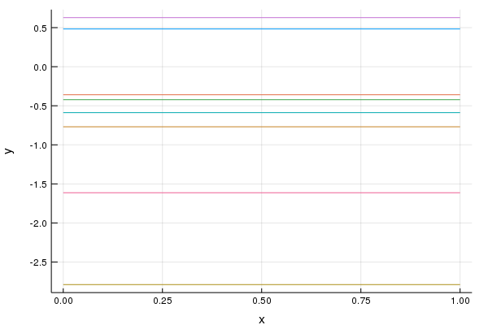
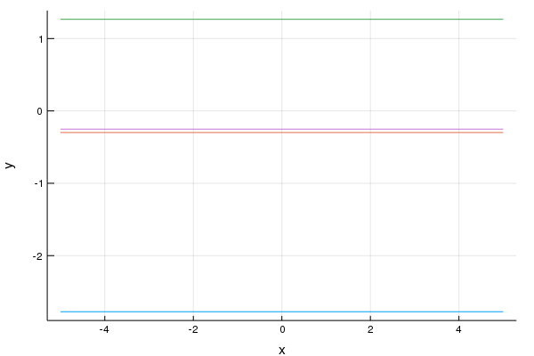
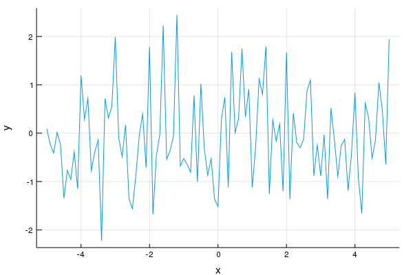
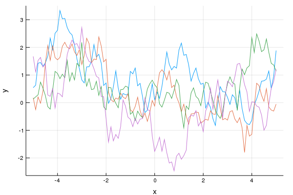
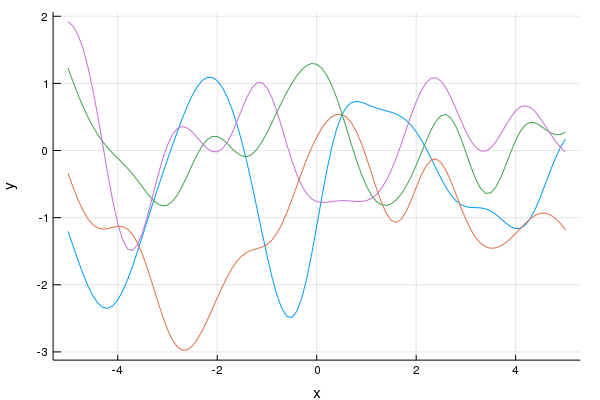
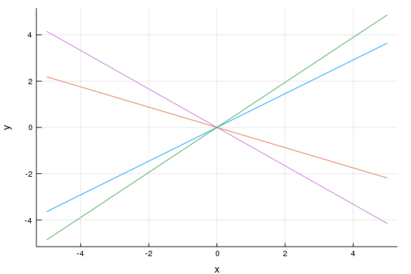
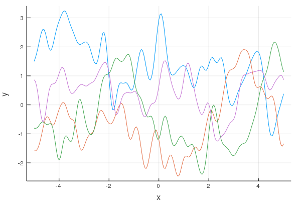
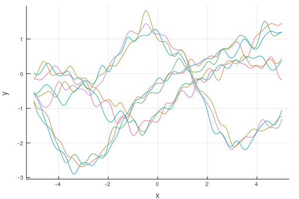

# Guide

[](https://github.com/biobakery/gptool.jl/actions)
[](https://kescobo.github.io/gptool.jl/stable)
[](https://kescobo.github.io/gptool.jl/dev)

This guide is intended to provide an overview of the basic workflow using GaPLAC. A complete command reference, as well as available covariance and likelihood functions are provided below.

## Installation

1. Install [Julia](https://julialang.org/).

2. Download GaPLAC's repository and unpack it s omewhere.

3. Open a console in GaPLAC's root folder and run `julia`.

4. At the Julia prompt, press `]` to access the package manager's prompt, then enter `activate .`, and `instantiate`. This will install the required packages and may take a few minutes. Once complete, use backspace to get back to the normal Julia prompt, and run `exit()` to quit Julia.

5. If on Mac/UNIX, to use `./gaplac ...` format, you may need to run `chmod u+x ./gaplac`.

## Generating some sample data

GaPLAC has five main commands to work with: `sample`, `mcmc`, `select`, `predict`, and `fitplot`. We will first look at `sample`, which draws a sample from a Gaussian Process. This can be helpful to visualize the kinds of functions described by a particular GP, or to provide some sample data to test later functions.

Run the following command from the GaPLAC root folder:

```
./gaplac sample "y :~| SExp(:x; l=1)" --at "x=-5:0.1:5" --plot gp_sample.png
```

This may take a few minutes the first time, since Julia must compile all the packages. It will produce a large amount of output to the console, and should also produce a plot in `gp_sample.png` which resembles:


If instead you get an error mentioning missing dependencies, it means that step 4 of the Installation section was not successfully completed. Try following the Installation instructions again to resolve this.

Let's look at each of the pieces of the command:

- `"y :~| SExp(x; l=1)"`: This is the GP formula, much like a model formula in R. In this case, the output (`y`) is modeled as a GP with a Squared-Exponential covariance function (`SExp`) with a lengthscale (`l`) of `1`. Note also the `:` in `:~|`. Normally, a data likelihood (described later) can be specified between the `:` and the `~`, but here we don't specify anything, and the GP will be modeled _without_ a likelihood. This effectively allows us more directly observe the types of dynamics modeled by the Gaussian Process described in the formula.
- `--at "x=-5:0.1:5"`: This tells GaPLAC what values of `x` to sample the GP at.
- `--plot gp_sample.png`: Plot the dynamics here.

Try changing the lengthscale of the `SExp` term. How does this affect the function? Try adding other components (the full list is at the end of this document) by adding them to the formula, such as an Ornstein-Uhlenbeck process (`OU(x; l=1)`), or simply some `Noise`.

Now let's generate a smaller set of data at some randomly chosen `x` coordinates, and store the results in a file instead of printing to stdout:

```
./gaplac sample "y :~| SExp(x; l=1.5)" --at "x = rand(Uniform(-5,5), 50)" --output data.tsv
```

Look at the contents of `data.tsv`. It should contain two columns: `x` and `y`, and the rows are not sorted in any way. We will use this data for the next command.


## Fitting parameters

We are usually interested in the parameters of the covariance function which best fits some data. This is accomplished with the `mcmc` command in GaPLAC, which will produce a [MCMC chain](https://en.wikipedia.org/wiki/Markov_chain_Monte_Carlo) of samples from the posterior distribution of the model parameters.

Try running the following command:

```
./gaplac mcmc "y ~| SExp(x)" --data data.tsv --output mcmc.tsv --samples 500
```

First, note that the model formula omits the additional `:` before the `~`. This will therefore default to a Gaussian likelihood. During inference, you will almost always want to have at least some kind of noise/error term which allows for some additional variation from the GP, as fitting without this term can lead to computational difficulties.

Now examine the output file `mcmc.tsv`. Instead of showing a relationship between `x` and `y`, as the previous run of `sample` did, this file should contain several columns of parameter values, as well as the all-important final column containing the log of the unnormalized posterior density for the sample (think of this something like the goodness of fit). In particular, take a look at the covariance function parameter `l`, which we set above in the model formula to `1.5`, but which we did not tell the `mcmc` command. If all worked well, the mean of this parameter should converge to, and hover around the true value of `1.5`.

## Making predictions

Armed with some likely parameter values, we can now use the trained model to make some predictions for unobserved values. Try running the following:

```
./gaplac predict "y ~| SExp(x)" --data data.tsv --mcmc mcmc.tsv --at "x=-8:0.1:8" --output prediction.tsv
```

This will produce a prediction for the values of the process for `x` values from -8 to 8. Since the dataset ranges from -5 to 5, some of these are far from actual data points. Try plotting the various quantiles in `prediction.tsv` (the `Q` columns) and observe how the prediction relates to the presence of data points.

## Comparing models

`mcmc` fits a single model, but how do we know it's the right model? Maybe another model would be a better fit? To answer this question, we can run `mcmc` again with the other model. In this case, let's test a different kind of time-varying process called an Ornstein-Uhlenbeck (OU) process:

```
./gaplac mcmc "y ~| OU(x)" --data data.tsv --output mcmc_ou.tsv --samples 500
```

This will give us a second set of model fit results in a new `mcmc_ou.tsv` file. Now we can use those goodness-of-fit values in each of the files to determine which of the models we believe (hint: we generated data from a Squared-Exponential covariance function, and thus we expect the OU process will perform worse. Let's test that with the `select` command:

```
./gaplac select --mcmc mcmc.tsv --mcmc2 mcmc_ou.tsv
```

This will compare the log posterior values stored in each of the MCMC chains, and summarize them as a [Bayes Factor](https://en.wikipedia.org/wiki/Bayes_factor), which is reported in log2 scale. Here, log2 Bayes Factors greater than 1 indicate that the first model (in this case the Squared-Exponential) should be preferred, while negative numbers indicate the opposite - that the second model (passed by `--mcmc2`) should be preferred.

# Command reference

## `sample`

Generate samples from a Gaussian Process.
```
./gaplac sample <formula> [options]
```

Options are:
* `-x`, `--data`: Input training data; see [Input and output](#input-variables). If specified, the sampled GP is conditional on the provided data.
* `--rmv_outliers`, `--outlier_fields`, `--outlier_ignore`: [Automatic outlier removal](#automatic-outlier-removal).
* `-m`, `--mcmc`: If specified, the hyperparameters for the GP to sample are sampled from the given MCMC chain.
* `-t`, `--atdata`, or `--at`: Independent variables at which to sample the GP; see [Target input variables](#target-input-variables).
* `-o`, `--output`: Output the sampled GP values to a file. Supports `--data` format specifiers, and can be `stdout`.
* `--plot`: When present, produces a plot of the sampled GP, automatically attempting to guess the X axis.
* `--plotx`: Specify the variable to use for the X axis of the plot. This can also be set to `variable:group`.

## `mcmc`

Generate a MCMC chain of the hyperparameters of a Gaussian Process.
```
./gaplac mcmc <formula> [options]
```

Options are:
* `-x`, `--data`: Input training data; see [Input and output](#input-variables). If specified, the sampled GP is conditional on the provided data.
* `--rmv_outliers`, `--outlier_fields`, `--outlier_ignore`: [Automatic outlier removal](#automatic-outlier-removal).
* `-m`, `--mcmc`: If specified, extends the given chain.
* `-r`, `--burnin`: Number of burn-in samples to discard (default 0).
* `-t`, `--thin`: Number of samples to generate per sample output (default 1).
* `-n`, `--samples`: Number of samples to output (after burn-in and thinning; default: 100).
* `-o`, `--output`: Output filename to store the chain info in. Supports `stdout`.

## `select`

Calculate model selection statistics from MCMC chains and output to stdout.
```
./gaplac select [options]
```

Options are:
* `-m`, `--mcmc`: The first chain to compare.
* `-c`, `--mcmc2`: The second chain to compare.

## `predict`

Predict the values of a Gaussian Process at specific points (i.e. calculate the posterior mean and variance at a set of points).
```
./gaplac predict <formula> [options]
```

Options are:
* `-x`, `--data`: Input training data; see [Input and output](#input-variables). If specified, the predictions are made conditional on the provided data.
* `--rmv_outliers`, `--outlier_fields`, `--outlier_ignore`: [Automatic outlier removal](#automatic-outlier-removal).
* `-m`, `--mcmc`: If specified, the prediction is taken over the distribution of hyperparameters in the MCMC chain.
* `-t`, `--atdata`, or `--at`: Independent variables at which to predict the GP; see [Target input variables](#target-input-variables).
* `-o`, `--output`: Output the predictions to a file. Supports `--data` format specifiers, and can be `stdout`.

## `fitplot`

Note: The `fitplot` command is not fully implemented yet.

# Input and output

## Input variables

The variables which can be used in the formulas are provided to GaPLAC using the `--data` parameter, in the form of a `;`-separated list of filenames for tab- or comma-separated tables (supports `stdin` as a filename as well). For example:
```
--data table1.csv;table2.tsv
```

The column/row names of these tables are used as the variable names in the GP formulas. To ensure names are valid Julia identifiers, any non-alphanumeric characters are first transformed into underscores. If the first character is not a letter or an underscore, then `X` is prepended to the name. If a variable is specified in multiple tables, then the table specified earlier in the `--data` list takes precedence.

Additional flags may also be specified before a `:` before the file names to indicate certain attributes of the files. These are:
* `#`: Transpose the table, so rows represent variables.
* `~`: The file is interpreted as a tab-separated file, regardless of extension.
* `,`: The file is interpreted as a comma-separated file, regardless of extension.

An identifier can also be specified, giving the name of the variable to use to join the tables. If not given, `gaplac` will attempt to guess based on the uniqueness of the values of variables and presence across tables. For example, the following will use the `id` column of `data.tsv` and `subjectid` row of `subjects.tsv`:
```
--data id:data.tsv;#subjectid:subjects.tsv
```

## Target input variables

Specifying where to sample or predict a GP can be done in two ways. The first is to provide a file containing the independent variables in the GP. This is specified using `--atdata`, and has the same format as `--data`. The second is to construct this using `--at`, which is a `;`-separated list of `variable=value` pairs specifying the values of the independent variables. These can have several formats:
* `variable=value`: Set the variable to the given value for all data points. `value` can be a Julia expression.
* `variable=start:step:end`: Creates a data point for each value in the linear interpolation from `start` to `end`, stepping by `step`.
* `variable=<Julia Distribution>`: Samples the Julia distribution for each data point.
* `variable/group=value`: For every value of the previously-defined variable `group`, set `variable` to `value`, which can be a linear interpolation or Julia distribution as above.

Variables are added in the order they are specified, so be wary of where distributions are specified. In particular, if they are specified earlier in the variable list, their sampled values may be duplicated across many rows created by interpolations.

For example, to create a set of "individuals" identified by an `id`, and a linear `time` scale for each individual, you might use `--at id=1:1:10;time/id=0:0.1:10`.

## Automatic outlier removal

GaPLAC can automatically filter out outliers based on several criteria. Currently only inner-fence-based outlier detection is supported. This is enabled by setting `--rmv_outliers` to `fence`. By default when this is enabled, all numeric independent variables in the GP are filtered for outliers. If additional variables not included in the GP formula should be included in outlier removal (e.g. if running a null model, but the set of data should still be the same as a full model), these can be specified by `--outlier_fields`. Fields that would normally be included but should not be can be specified by `--outlier_ignore`.

# Gaussian process formulas

Formulas specify the form of the covariance function of the Gaussian Process, its data likelihood, as well as the values of any hyperparameters and their priors. Because of this, the formula effectively encodes the hypothesis you are testing when using GaPLAC.

Formulas have the following syntax:

```
observation [: likelihood] ~| covariance_function
```

Formulas are designed to resemble model formulas in R to allow those familiar with R's model formulas to gain some intuition into working with these formulas. However, it is important to remember that model formulas in R are used to specify fixed effects, while formulas here model covariance. To distinguish these, note that formulas here include `~|` rather than simply `~`, following the usual specification of random effects in R's formulas using `|`.

The `observation` can be any Julia expression of the input variables. The `covariance_function` is an expression of covariance function components, and has more restricted syntax. It is recommended that you test what types of functions are described by a covariance function before using it in your workflow using the `sample` command.

## Basic covariance functions

### Categorical

Syntax: `Cat(x)`

> k(i,j) = 1 if x[i] == x[j], 0 otherwise

Produces a covariance of `1` between samples with the same `x`, otherwise `0`.

`./gaplac sample "y :~| Cat(k)" --at "k=1:8;x/k=0:1" --plot sample_plot.png --plotx x:k`



Categorical covariance functions represent the covariation between members of the same group. For example, samples gathered from the same individual will tend to be more similar to each other than samples, which might be represented by `Cat(person)`. Categorical covariance functions are frequently multiplied by another function from the set below, which then describes the dynamics _within_ the group, which is independent from another member of the group (see the discussion below on [multiple time-varying components](#Multiple-time-varying-components)).

The categorical covariance function is also useful for visualizing the possible dynamics of the various covariance functions below, since it can effectively draw independent samples from those covariance functions in a single invocation of GaPLAC. Here, each category `k` produces a different, independent sample from the GP, which is visualized with a different line for each `k` using `--plotx x:k`.

### Constant

Syntax: `Constant(σ2=magnitude)`

> k(i,j) = σ2

A constant covariance with the given magnitude. The shorthand `1` can be used for this, as in `y ~| 1`.

`./gaplac sample "y :~| Cat(k) * Constant" --at "k=1:4;x/k=-5:0.1:5" --plot sample_plot.png --plotx x:k`



### Noise

Syntax: `Noise`

> k(i,j) = 1 if i == j, otherwise 0

`./gaplac sample "y :~| Noise" --at "x=-5:0.1:5" --plot sample_plot.png --plotx x`

Uncorrelated variation - adds a covariance of `1` only from a sample to itself.



### Ornstein-Uhlenbeck

Syntax: `OU(x; l=lengthscale)`

> k(i,j) = exp(abs(x[i] - x[i])/l)

`./gaplac sample "y :~| Cat(k) * OU(x; l=1)" --at "k=1:4;x/k=-5:0.1:5" --plot sample_plot.png --plotx x:k`



### Squared-exponential

Syntax: `SExp(x; l=lengthscale)`

> k(i,j) = exp(.5*(x[i] - x[i])^2/l^2)

`./gaplac sample "y :~| Cat(k) * SExp(x; l=1)" --at "k=1:4;x/k=-5:0.1:5" --plot sample_plot.png --plotx x:k`



### Periodic

Syntax: `Periodic(x; l=lengthscale, p=period)`

> k(i,j) = exp(.5*(x[i] - x[i])^2/l^2)

`./gaplac sample "y :~| Cat(k) * Periodic(x; l=0.6, p=2)" --at "k=1:4;x/k=-5:0.1:5" --plot sample_plot.png --plotx x:k`


Decaying periodicity can be encoded by mixing in an Ornstein-Uhlenbeck or Squared Exponential component:

`./gaplac sample "y :~| Periodic(x; l=0.3, period=1) * SExp(x; l=2)" --at "x=-10:0.1:10" --plot sample_plot.png --plotx x`


### Linear

Syntax: `Linear(x)`

> k(i,j) = x[i] * x[j]

`./gaplac sample "y :~| Cat(k) * Linear(x)" --at "k=1:4;x/k=-5:0.1:5" --plot sample_plot.png --plotx x:k`



## More complex functions

Covariance functions can be added together, in which case the functions they represent are added together, or they can be multiplied together, in which case their effects attenuate each other (as in the decaying periodic function above).

### Multiple time-varying components

A slow-varying component can be added to a rapid component:

`./gaplac sample "y :~| Cat(k) * (SExp(x; l=2) + SExp(x; l=0.3) * Constant(0.3))" --at "k=1:4;x/k=-5:0.05:5" --plot sample_plot.png --plotx x:k`



### Hierarchical group effects

Suppose you have an experiment with mice. Mice are often grouped into cages, and there is often a very strong cage effect. We can model this as a hierarchical model with one component describing the changes within a cage, and another component describing the individual mouse's differences from the cage mean:

`./gaplac sample "y :~| Cat(cage) * (SExp(x; l=2.5) + Cat(mouse) * SExp(x; l=0.3) * Constant(0.03))" --at "mouse=1:9;cage=floor.((mouse.-1)./3);x/mouse=-5:0.05:5" --plot sample_plot.png --plotx x:mouse`



## Variance parameters

You may notice that only one covariance function contains an explicit variance hyperparameter: `Constant`. This is done to make the covariance functions more composable (e.g. they can be multiplied together without introducing two variance hyperparameters). However, it would be annoying to have to re-specify a `Constant` covariance function to multiply into every component that needs a variance hyperparameter. To simplify this, GaPLAC will automatically multiply a `Constant` covariance function with any component that does not already have one.

For example, the following formulas are equivalent:
```
y :~| SExp(l=3)
y :~| SExp(l=3) * Constant
```

If you do not want this `Constant` covariance function to be added (thus adding a variance hyperparameter which will be optimized), multiply in a manual `Constant(1)` covariance function, as in:
```
y :~| SExp(l=3) * Constant(1)
```

## Hyperparameter priors

All covariance function parameters can be optimized by the `mcmc` command. To specify the prior of these variables, set their value to a Julia distribution. For example to set the lengthscale parameter of a Squared Exponential covariance function to a Gamma distribution with shape 2 and scale 3, use the following:
```
y :~| SExp(l=Gamma(2,3))
```

Setting the hyperparameter to a single value sets it to a Delta distribution, and removes it from optimization in `mcmc`. To set the hyperparameter to an initial value *and* set its prior, specify both, as in:
```
y :~| SExp(l=1.2, l=Gamma(2,3))
```

Note that the prior should be specified *after* the initial value.

## Data likelihoods

***TODO: list of data likelihoods***
