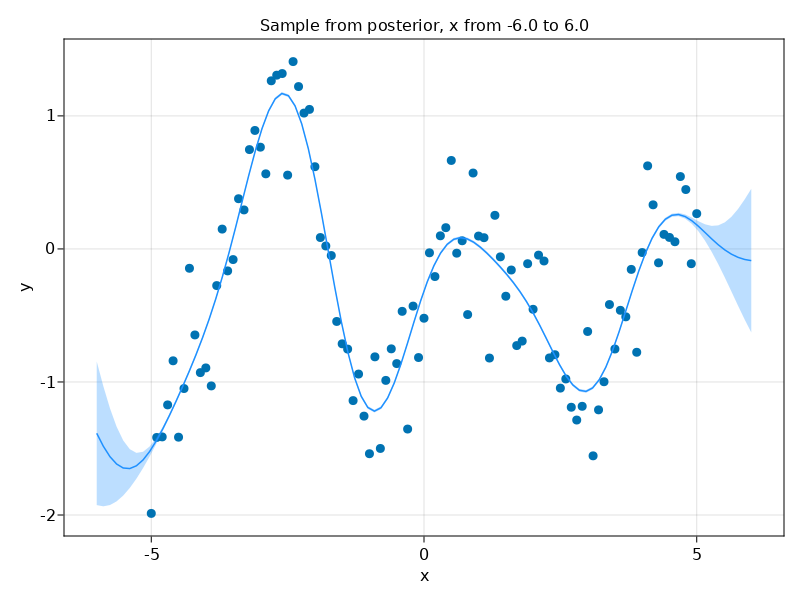

# Guide

This guide is intended to provide an overview of the basic workflow using GaPLAC. A complete command reference, as well as available covariance and likelihood functions are provided below.

## Installation

1. Install [Julia](https://julialang.org/).

2. Download GaPLAC's repository and unpack it somewhere.

3. Open a console in GaPLAC's root folder and run `julia`.

4. At the Julia prompt, enter `]activate .`, then `instantiate`. This will install the required packages. Use backspace to get back to the normal Julia prompt, and run `exit()` to quit Julia.

## Generating some sample data

GaPLAC has five main commands to work with: `sample`, `mcmc`, `select`, `predict`, and `fitplot`. We will first look at `sample`, which simply draws a sample from a Gaussian Process. This can be helpful to visualize the kinds of functions described by a particular GP, or in this case to provide some sample data to work with in the later functions.

Run the following command from the GaPLAC root folder:

```
julia ./cli/main.jl sample "y :~| SExp(x; l=1)" --at "x=-5:0.1:5" --plot gp_sample.png
```

This should produce a plot in `gp_sample.png` which resembles:



Let's look at each of the pieces of the command:

- `"y :~| SExp(x; l=1)"`: This is the GP formula, much like a model formula in R. In this case, the output (`y`) is modeled as a GP with a Squared-Exponential covariance function (`SExp`) with a lengthscale (`l`) of `1`.
- `--at "x=-5:0.1:5"`: This tells GaPLAC what values of `x` to sample the GP at.
- `--plot gp_sample.png`: Output the pretty plot here.

Try changing the lengthscale of the `SExp` term. How does this affect the function? Try adding other components (the full list is at the end of this document) by adding them to the formula, such as an Ornstein-Uhlenbeck process (`OU(x; l=1)`), or simply some `Noise`.


## Fitting parameters

***run mcmc to recover parameters***

## Comparing models

***run select to determine which model we should use***

## Making predictions

## Diagnostic plots

# Command reference

## `sample`

## `mcmc`

## `select`

## `predict`

## `fitplot`

# Input and output

## Input variables

The variables which can be used in the formulas are provided to GaPLAC using the `--data` parameter, in the form of a set of tab- or comma-separated tables. The column/row names of these tables are used as the variable names.

***non-conforming variable names***.

***--data format***

## Target input variables

***--atdata and --at formats***

## Output

***--output format***

***--plot format***

# Gaussian process formulas

Formulas specify the form of the covariance function of the Gaussian Process, its data likelihood, as well as the values of any hyperparameters and their priors. Because of this, the formula effectively encodes the hypothesis you are testing when using GaPLAC.

Formulas have the following syntax:

```
observation [: likelihood] ~| covariance_function
```

Formulas are designed to resemble model formulas in R to allow those familiar with R's model formulas to gain some intuition into working with these formulas. However, it is important to remember that model formulas in R are used to specify fixed effects, while formulas here model covariance. To distinguish these, note that formulas here include `~|` rather than simply `~`, following the usual specification of random effects in R's formulas using `|`.

The `observation` can be any Julia expression of the input variables. The `covariance_function` is an expression of covariance function components, and has more restricted syntax. It is recommended that you test what types of functions are described by a covariance function before using it in your workflow using the `sample` command.

## Basic covariance functions

### Constant

### Categorical

### Ornstein-Uhlenbeck

### Squared-exponential

`gaplac sample "y :None ~| Cat(person) * SExp(time; l=1)" --at "person=1:4;time/person=-5:0.1:5" --plot sample_plot.png --plotx time:person`

### Periodic

### Linear


## More complex examples

`gaplac sample "y ~| Cat(person) * <covariance function>" --at person=1:4;time=-5:0.1:5 --plot sample_plot.png --plotx time:person`


## Variance parameters

***discuss how variance parameters are handled***

## Data likelihoods

### Predictions


